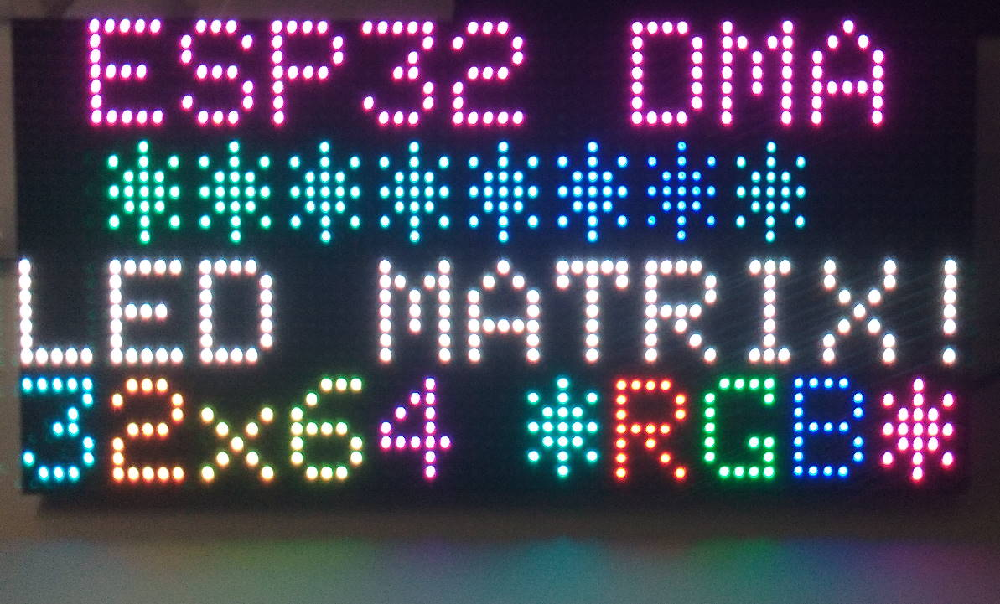

# Adafruit_GFX RGB64x32MatrixPanel library for ESP32 based on experimental ESP32 I2S DMA!

ESP32 Arduino library for P3 64x32 RGB LED Matrix Panel, which leverages the DMA functionality of the ESP32's I2S 'LCD Mode' which bascially means that pixel data can be sent straight from memory, via the DMA controller, to the relevant GPIO pins (RGB Matrix) with no overhead to either CPU! Most other library require the CPU to constantly bit-bang the GPIO (either with SPI as well), which results in flickery outcomes when using either CPU and decreased performance of your sketch.

As a result, this library can provide 24 bit colour, at various brightness levels without resulting in flicker.



# Installation

You need to install [Adafruit_GFX_Library](https://github.com/adafruit/Adafruit-GFX-Library) from the "Library > Manage Libraries" menu.

## Patching GPIO to avoid eratta of ESP32

You should patch the `tools/sdk/ld/esp32.peripherals.ld` to avoid random pixel noise on the display as following:

```
/* PROVIDE ( GPIO = 0x3ff44000 ); */
PROVIDE ( GPIO = 0x60004000 );
```

Please refer section 3.3. in https://www.espressif.com/sites/default/files/documentation/eco_and_workarounds_for_bugs_in_esp32_en.pdf for more details.

# Wiring ESP32 with the LED Matrix Panel

If you wish to change this, you will need to adjust in the header file.

```
+-----------+   Panel - ESP32 pins
|  R1   G1  |    R1   - IO25      G1   - IO26
|  B1   GND |    B1   - IO27
|  R2   G2  |    R2   - IO14      G2   - IO12
|  B2   GND |    B2   - IO13
|   A   B   |    A    - IO23      B    - IO22
|   C   D   |    C    - IO 5      D    - IO17
| CLK   LAT |    CLK  - IO16      LAT  - IO 4
|  OE   GND |    OE   - IO15
+-----------+
```

The panel must be powered by 5V AC adapter with enough current capacity.
(Current varies due to how many LED are turned on at the same time. To drive all the LEDs, you need 5V4A adapter.)

# Usage

Work in progress at the moment. Run the .ino file once hooked up.

# Notes

Currently WIP. Seems to work extremly well and drive a RGB panel with 24bit color at very high refresh rates.

# Credits

Based off the 'SmartMatrix' project code: https://github.com/pixelmatix/SmartMatrix/tree/teensylc

Which is based off Sprite_TM's demo implementation here: https://www.esp32.com/viewtopic.php?f=17&t=3188
